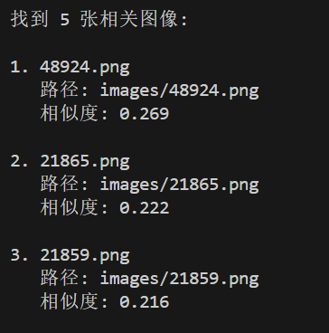
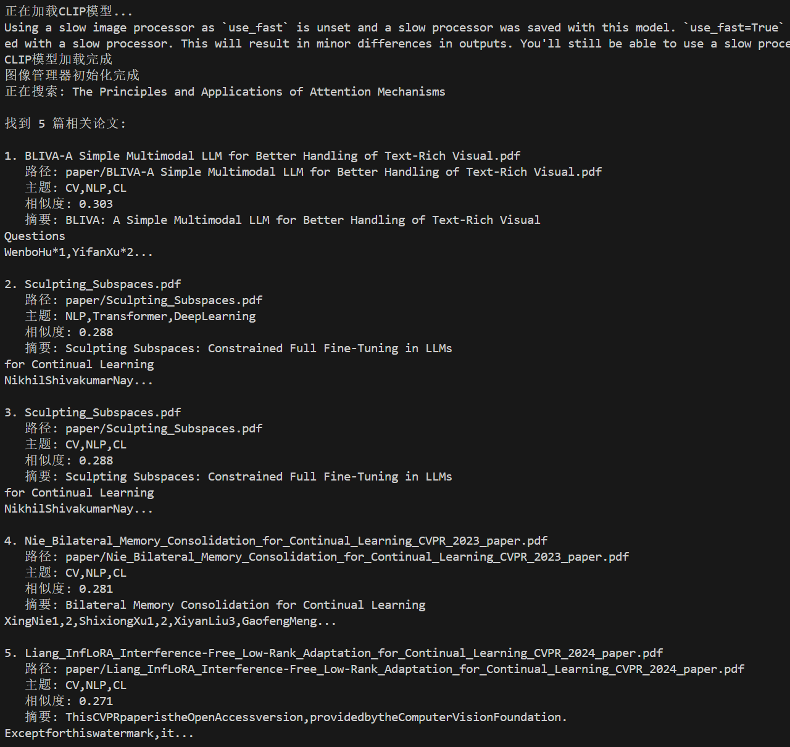
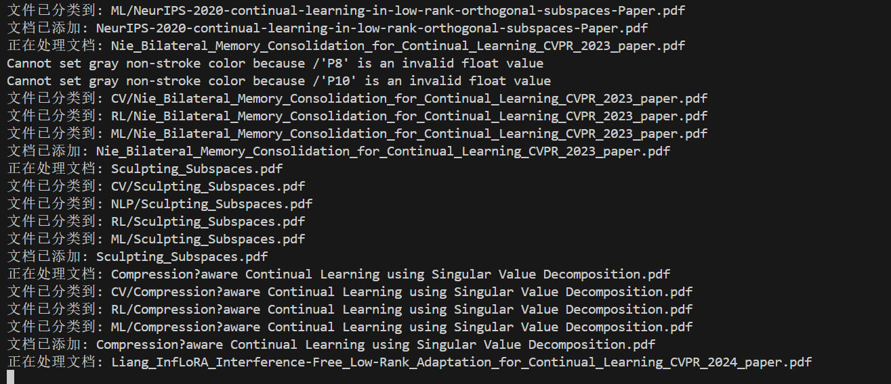
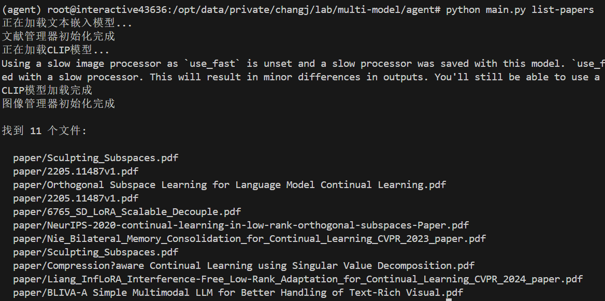
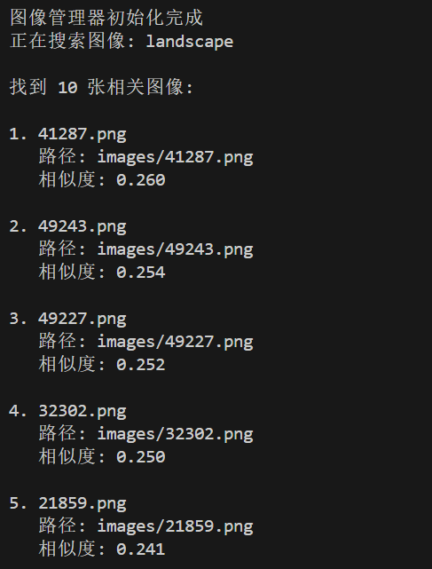
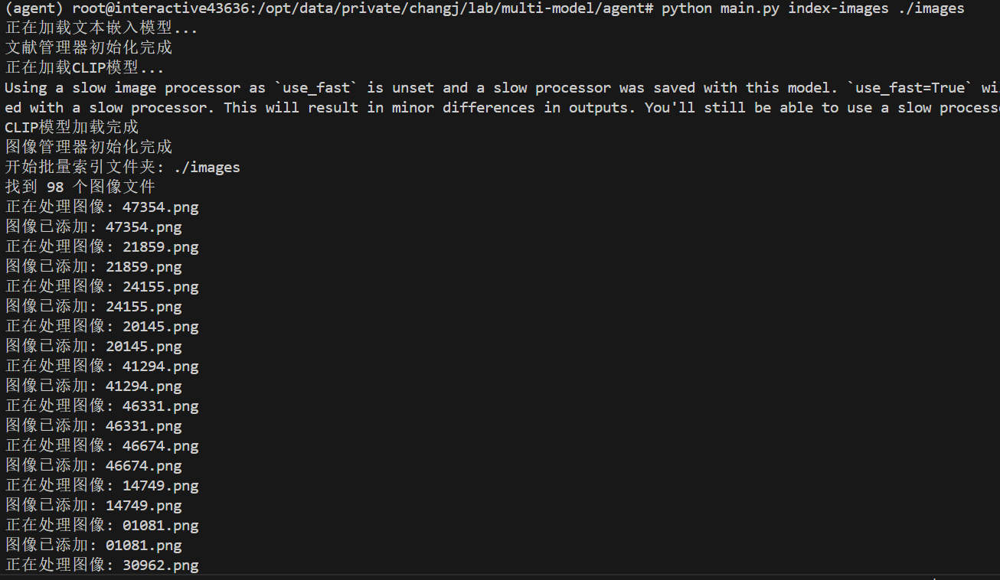
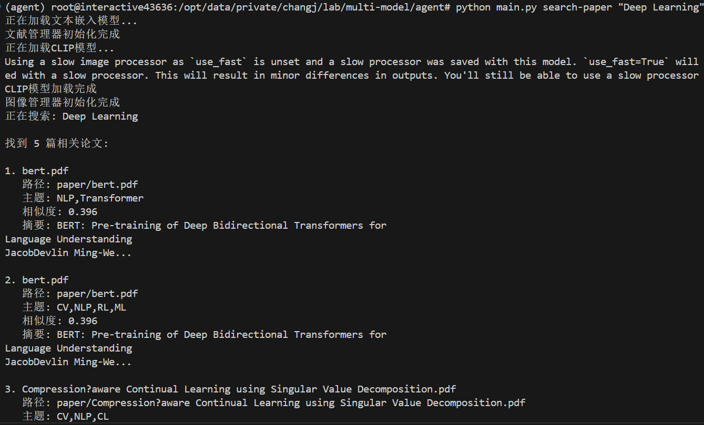
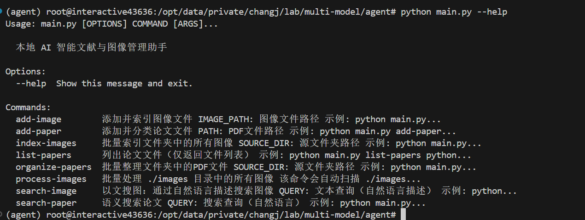

# 📚 本地 AI 智能文献与图像管理助手

<div align="center">


**基于多模态 AI 的本地知识库智能管理系统**

[功能特性](#-核心功能) • [快速开始](#-快速开始) • [使用文档](#-使用说明) • [技术栈](#-技术栈)

[](https://github.com/yourusername/your-repo)
[](https://github.com/yourusername/your-repo)

</div>

---

## 📖 项目简介

本项目是一个基于 Python 的**本地多模态 AI 智能助手**，旨在解决本地大量文献和图像素材管理困难的问题。不同于传统的文件名搜索，本项目利用多模态神经网络技术，实现对内容的**语义搜索**和**自动分类**。

### ✨ 核心优势

- 🔍 **语义搜索**：使用自然语言提问，无需记忆文件名
- 🤖 **智能分类**：自动识别内容主题并分类整理
- 🖼️ **图文匹配**：通过文字描述搜索相关图像
- 🔒 **完全本地化**：所有数据存储在本地，保护隐私
- ⚡ **轻量高效**：支持 CPU 运行，可选 GPU 加速

---

## 🚀 核心功能

### 📄 智能文献管理

| 功能 | 描述 |
|------|------|
| **语义搜索** | 使用自然语言提问（如"Transformer 的核心架构是什么？"），系统基于语义理解返回最相关的论文文件 |
| **自动分类** | 添加新论文时，根据指定主题（如 "CV, NLP, RL"）自动分析内容并归类到对应文件夹 |
| **批量整理** | 一键整理混乱文件夹，自动扫描所有 PDF，识别主题并归档到相应目录 |
| **文件索引** | 快速返回相关文件列表，方便定位所需文献 |

### 🖼️ 智能图像管理

| 功能 | 描述 |
|------|------|
| **以文搜图** | 通过自然语言描述（如"海边的日落"）查找本地图片库中最匹配的图像 |
| **批量处理** | 支持批量索引和处理图像文件，自动跳过已处理文件 |
| **递归扫描** | 支持递归处理子目录中的所有图像文件 |

---

## 🛠️ 技术栈

### 核心技术

<div align="center">

| 模块 | 技术选型 | 说明 |
|------|---------|------|
| **文本嵌入** | `SentenceTransformers` (all-MiniLM-L6-v2) | 轻量级，速度快，支持多语言 |
| **图像嵌入** | `CLIP` (ViT-B-32) | OpenAI 开源经典图文匹配模型 |
| **向量数据库** | `ChromaDB` | 嵌入式数据库，无需服务器 |
| **PDF 处理** | `pdfplumber` + `PyPDF2` | 高精度文本提取 |
| **命令行** | `Click` | 友好的 CLI 界面 |

</div>

### 系统要求

- **操作系统**: Windows / macOS / Linux
- **Python 版本**: Python 3.8 及以上
- **内存**: 建议 8GB 及以上
- **存储空间**: 模型文件约 700MB

---

## 📦 安装与配置

### 1. 克隆项目

```bash
# 替换为您的 GitHub 仓库地址
git clone https://github.com/yourusername/your-repo.git
cd agent
```

### 2. 创建虚拟环境（推荐）

```bash
# Windows
python -m venv venv
venv\Scripts\activate

# macOS/Linux
python3 -m venv venv
source venv/bin/activate
```

### 3. 安装依赖

```bash
pip install -r requirements.txt
```

> 💡 **提示**: 首次运行时，程序会自动下载所需的模型文件（约 700MB），请确保网络连接正常。

---

## 🏗️ 项目结构

```
agent/
├── main.py                 # 统一入口文件
├── requirements.txt        # 依赖包列表
├── README.md              # 项目说明文档
├── QUICKSTART.md          # 快速开始指南
├── src/                   # 源代码目录
│   ├── __init__.py
│   ├── document_manager.py    # 文献管理模块
│   └── image_manager.py       # 图像管理模块
├── data/                  # 数据目录（自动创建）
│   ├── documents/         # 文献存储目录
│   ├── images/            # 图像存储目录
│   └── chroma_db/         # 向量数据库存储目录
└── images/                # 待处理图像目录（与 data 同级）
```

---

## 📚 使用说明

### 📄 文献管理

#### 1. 添加并分类单个论文

```bash
python main.py add-paper paper.pdf --topics "CV,NLP,RL"
```

**功能**:
- 提取 PDF 文本内容
- 生成语义嵌入向量并存储
- 根据主题自动分类到对应子文件夹

**示例**:
```bash
# 添加计算机视觉相关论文
python main.py add-paper transformer.pdf --topics "CV,DeepLearning"

# 添加自然语言处理相关论文
python main.py add-paper bert.pdf --topics "NLP,Transformer"
```



#### 2. 语义搜索论文

```bash
python main.py search-paper "What is the core architecture of a Transformer?"
```

**可选参数**:
- `--top-k` 或 `-k`: 返回最相关的 k 个结果（默认 5 个）

**示例**:
```bash
# 搜索关于注意力机制的论文
python main.py search-paper "The Principles and Applications of Attention Mechanisms"

# 返回前 10 个最相关的结果
python main.py search-paper "Deep Learning" --top-k 10
```

**输出示例**:
```
找到 5 篇相关论文:

1. transformer.pdf
   路径: data/documents/CV/transformer.pdf
   主题: CV,DeepLearning
   相似度: 0.856
   摘要: Transformer is a model architecture eschewing recurrence...
```



#### 3. 批量整理文件夹

```bash
python main.py organize-papers ./paper --topics "CV,NLP,RL"
```

**功能**:
- 扫描指定文件夹中的所有 PDF 文件
- 自动提取文本并生成索引
- 根据内容匹配主题并分类到对应目录

**示例**:
```bash
# 整理当前目录下的 papers 文件夹
python main.py organize-papers ./paper --topics "CV,NLP,RL,ML"

# 整理绝对路径的文件夹
python main.py organize-papers "C:\Users\Documents\Papers" --topics "CV,NLP"
```



#### 4. 列出论文文件

```bash
# 列出所有文件
python main.py list-papers

# 根据查询列出相关文件
python main.py list-papers --query "deep learning"
```



---

### 🖼️ 图像管理

#### 1. 添加并索引图像

```bash
python main.py add-image photo.jpg
```

**支持的格式**: jpg, jpeg, png, bmp, gif, webp

**示例**:
```bash
python main.py add-image sunset.jpg
python main.py add-image landscape.png
```



#### 2. 以文搜图

```bash
python main.py search-image "Sunset by the Sea"
```

**可选参数**:
- `--top-k` 或 `-k`: 返回最相关的 k 个结果（默认 5 个）

**示例**:
```bash
# 搜索日落相关的图片
python main.py search-image "Sunset by the Sea"

# 搜索动物相关的图片
python main.py search-image "A cute dog"

# 返回前 10 个最相关的结果
python main.py search-image "landscape" --top-k 10
```


#### 3. 批量索引外部文件夹

```bash
python main.py index-images ./images
```

**功能**: 扫描指定文件夹中的所有图像文件并生成索引

**示例**:
```bash
# 索引当前目录下的 images 文件夹
python main.py index-images ./images

# 索引绝对路径的文件夹
python main.py index-images "C:\Users\Pictures\Vacation"
```



#### 4. 批量处理 images 目录 ⭐

```bash
python main.py process-images
```

**功能**:
- 自动扫描 `./images` 目录下的所有图像文件（包括子目录）
- 自动跳过已经索引的文件，只处理新文件
- 支持递归处理所有子目录

**参数说明**:
- `--recursive` 或 `-r`: 是否递归处理子目录（默认启用）
- `--no-recursive`: 只处理根目录，不递归子目录

**示例**:
```bash
# 批量处理 ./images 目录中的所有图像（递归子目录）
python main.py process-images

# 只处理 ./images 根目录，不递归子目录
python main.py process-images --no-recursive

# 使用短参数
python main.py process-images -r
```

**使用场景**:
- 将图像文件直接放入 `./images` 目录后，使用此命令批量索引
- 适合定期批量处理新增的图像文件
- 自动跳过已索引的文件，避免重复处理

---

## 🎯 快速开始

### 测试文献管理功能

1. **准备测试文件**: 将一些 PDF 论文文件放在一个文件夹中，例如 `test_papers/`

2. **批量整理论文**:
```bash
python main.py organize-papers test_papers --topics "CV,NLP,ML"
```


3. **搜索论文**:
```bash
python main.py search-paper "Deep Learning"
```



### 测试图像管理功能

1. **准备测试文件**: 将图片文件放入 `./images/` 目录（可包含子目录）

2. **批量处理图像**:
```bash
python main.py process-images
```

3. **以文搜图**:
```bash
python main.py search-image "landscape"
```


### 查看所有命令

```bash
python main.py --help
```



查看特定命令的详细帮助：
```bash
python main.py add-paper --help
python main.py search-paper --help
python main.py search-image --help
```

---

## ⚙️ 高级配置

### GPU 加速

如果有 NVIDIA GPU，可以安装 GPU 版本的 PyTorch 以加速模型推理：

```bash
# CUDA 11.8
pip install torch torchvision torchaudio --index-url https://download.pytorch.org/whl/cu118

# CUDA 12.1
pip install torch torchvision torchaudio --index-url https://download.pytorch.org/whl/cu121
```

### 进阶模型配置

如果您拥有较好的硬件资源，可以尝试以下方案：

- **图像描述与问答**:
  - **Florence-2 (Microsoft)**: 轻量级全能视觉模型
  - **Moondream**: 专为边缘设备设计的小型视觉语言模型
  - **LLaVA**: 开源多模态大模型

- **文本理解**:
  - **本地 LLM**: 如 `Llama-3` 或 `Qwen-2` (通过 Ollama 部署)

---

## 📝 注意事项

1. **首次运行**: 首次运行时会自动下载模型文件，请确保网络连接正常

2. **存储空间**: 
   - 模型文件约占用 700MB 磁盘空间
   - 向量数据库会根据索引的文件数量增长

3. **性能优化**:
   - 如果有 NVIDIA GPU，可以安装 GPU 版本的 PyTorch 以加速模型推理
   - 对于大量文件，建议分批处理

4. **文件格式支持**:
   - 文献: 仅支持 PDF 格式
   - 图像: 支持 jpg, jpeg, png, bmp, gif, webp 格式

5. **数据安全**: 所有数据（文献、图像、向量索引）都存储在本地，不会上传到云端

---

## 🤝 贡献

欢迎提交 Issue 和 Pull Request！

1. Fork 本仓库
2. 创建特性分支 (`git checkout -b feature/AmazingFeature`)
3. 提交更改 (`git commit -m 'Add some AmazingFeature'`)
4. 推送到分支 (`git push origin feature/AmazingFeature`)
5. 开启 Pull Request

---

## 📄 许可证

本项目采用 MIT 许可证 - 查看 [LICENSE](LICENSE) 文件了解详情

---

## 👨‍💻 作者

**Your Name**

- GitHub: [@yourusername](https://github.com/yourusername)
- Email: your.email@example.com

---

## 🙏 致谢

- [SentenceTransformers](https://www.sbert.net/) - 文本嵌入模型
- [CLIP](https://github.com/openai/CLIP) - 图文匹配模型
- [ChromaDB](https://www.trychroma.com/) - 向量数据库
- [Click](https://click.palletsprojects.com/) - 命令行工具

---

## 📊 项目统计

<div align="center">


</div>

---

<div align="center">

**如果这个项目对您有帮助，请给一个 ⭐ Star！**

Made with ❤️ by [Your Name](https://github.com/yourusername)

</div>

